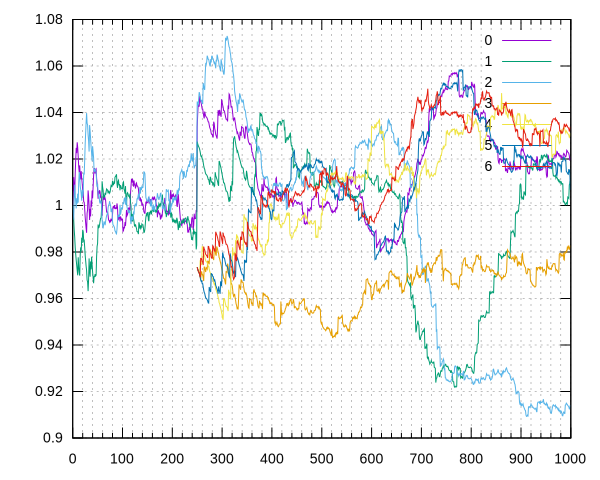

This repo implements an Exp3 multi-arm bandit algorithm, modified to run continuously with a sliding window of past results. Towards the bottom of index.js, you can see the scenario. It starts out with several nodes, some of them change their reward, a few get added, etc.



```
sudo apt-get install gnuplot ghostscript
npm install
npm start
```

Check output.svg for a graph.
